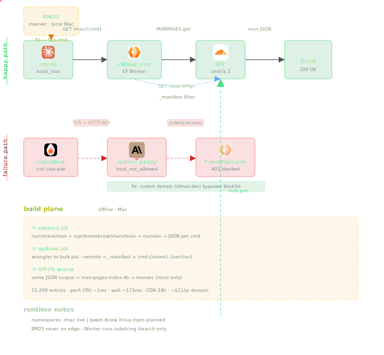

<p align="center">
  
</p>
<h1 align="center">climan</h1>
<p align="center">CLI documentation hub for AI agents at <a href="https://climan.dev">climan.dev</a></p>
<p align="center">no API key · just curl · hybrid semantic search</p>

---

<p align="center">
  
</p>

## Problem

Agents hallucinate CLI flags. Training data drifts. Vendor docs are authoritative but unreachable from agent sandboxes at query time.

| failure | symptom |
|---|---|
| invented parameters | `parameter cannot be found` on `-RecursiveDepth` |
| wrong alias semantics | `gci` flags guessed from training data |
| stale syntax | model cutoff vs current CLI version |

## Namespaces

| route | corpus | records | search | status |
|---|---|---|---|---|
| `/pwsh` | PowerShell 7.4 (MicrosoftDocs) | 302 | hybrid | live |
| `/kusto` | KQL / Azure Data Explorer (MicrosoftDocs) | 550 | hybrid | live |
| `/az` | Azure CLI (azure-docs-cli YAML) | 12,986 | hybrid | live |
| `/mac` | macOS man pages | - | - | planned |
| `/gh` | GitHub CLI | - | - | planned |

## Architecture

| layer | components |
|---|---|
| edge | Cloudflare Workers + Hyperdrive |
| data | Azure Postgres 16 + pgvector |
| search embed | Workers AI `bge-base-en-v1.5` |
| storage policy | no KV; one `docs` table, all namespaces |

## API

```http
GET /{ns}/{key}              exact lookup
GET /{ns}                    manifest
GET /search?q=&ns=           hybrid BM25 + dual-vector search
```

```bash
# exact lookup
curl https://climan.dev/pwsh/Get-ChildItem
curl https://climan.dev/az/vm/create
curl https://climan.dev/kusto/where-operator

# hybrid search
curl "https://climan.dev/search?q=find+files+recursively&ns=pwsh"
curl "https://climan.dev/search?q=scale+down+kubernetes+nodes&ns=az"
curl "https://climan.dev/search?q=filter+rows+by+condition&ns=kusto"
```

## Search

Hybrid BM25 + dual-vector cosine over Postgres. Two vectors per record:

| vector | embeds |
|---|---|
| `vec_func` | what the command does: name, summary, service, categories |
| `vec_flags` | how to invoke it: parameter names, types, accepted values |

Score: `BM25 × 0.3 + GREATEST(vec_func, vec_flags) × 0.7`

Model: `@cf/baai/bge-base-en-v1.5` (768d, `pooling=cls`) - same model at seed time and query time.

## Adding a namespace

1. Clone vendor docs → `climan-namespaces/{ns}-namespace/corpus/vendor/`
2. Copy `seed_az.py`, adapt `parse_{ns}()` for the source format
3. Run `seed_{ns}.py` - embeds + upserts into `docs`
4. Add one line to `NS_CONFIG` in `worker.js`
5. Deploy - `/search?ns={ns}` works automatically

See [`docs/decisions.md`](docs/decisions.md) for why each architectural choice was made.

## Setup

```bash
npm install
pip install psycopg2-binary requests pyyaml
cp .env.example .env   # CF_ACCOUNT, CF_TOKEN, PGPASSWORD
psql "$PGCONN" -f db/schema.sql
npx wrangler deploy
```

## Tools


## Contact

<a href="https://vd7.io"></a>
<a href="https://x.com/vdutts7"></a>